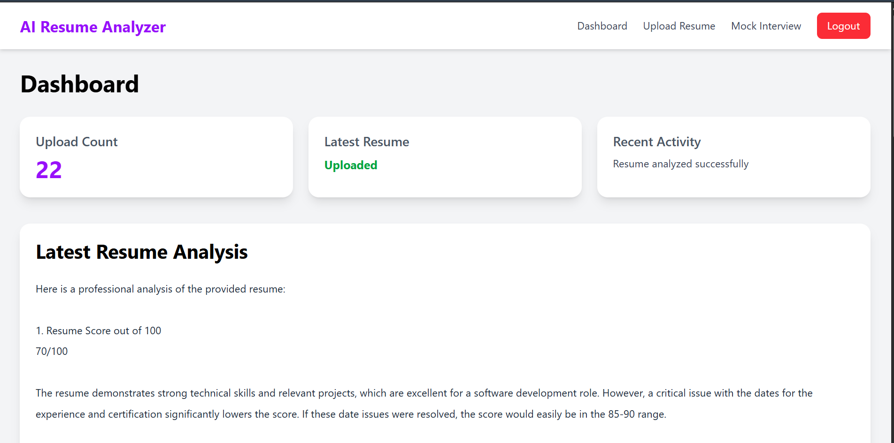
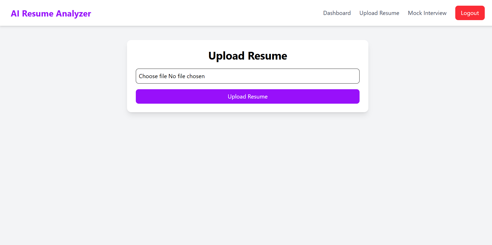

# AI Resume Analyzer & Mock Interview Platform

An AI-powered full-stack web application that helps users analyze resumes, receive AI-generated feedback, and generate role-specific mock interview questions.

---

## Features

- JWT Authentication
- Protected Routes
- Resume Upload System
- PDF Resume Parsing
- AI Resume Analysis using Gemini API
- Personalized Dashboard
- AI Mock Interview Question Generator
- MongoDB Database Integration
- Responsive UI with Tailwind CSS

---

## Tech Stack

### Frontend
- React.js
- Tailwind CSS
- Axios
- React Router DOM

### Backend
- Node.js
- Express.js
- MongoDB
- Mongoose
- JWT Authentication
- Multer
- PDF-Parse

### AI Integration
- Google Gemini API

---

## Folder Structure

```bash
project-root/
│
├── backend/
│   ├── ai/
│   ├── middleware/
│   ├── models/
│   ├── routes/
│   └── server.js
│
├── frontend/
│   ├── components/
│   ├── pages/
│   └── App.jsx
│
├── .gitignore
├── README.md
```

---

## Installation

### Clone Repository

```bash
git clone YOUR_REPOSITORY_LINK
```

---

## Backend Setup

```bash
cd backend

npm install
```

Create `.env` file inside backend:

```env
PORT=5000

MONGO_URI=YOUR_MONGODB_URI

JWT_SECRET=YOUR_SECRET_KEY

GEMINI_API_KEY=YOUR_GEMINI_API_KEY
```

Run backend:

```bash
npm run dev
```

---

## Frontend Setup

```bash
cd frontend

npm install

npm run dev
```

---

## Application Workflow

```text
User Login
    ↓
Upload Resume
    ↓
PDF Parsing
    ↓
Gemini AI Resume Analysis
    ↓
Store Analysis in MongoDB
    ↓
Display Personalized Dashboard
    ↓
Generate AI Mock Interview Questions
```

---

## Screenshots

### Dashboard


### Resume Upload


---

## Future Improvements

- ATS Resume Matching
- Voice-Based Mock Interview
- AI Answer Evaluation
- Resume Score Charts
- Dark Mode
- Deployment

---

## Author

Ankit Thapa

---

## License

This project is for educational and portfolio purposes.